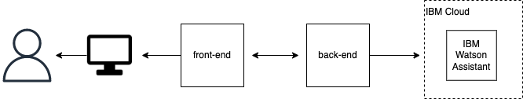

# Kira
 
 ⭐️ Note: If you are not a developer, or you just want to see the final result I recommend you to go to [section 5](#mobile-web-application).

## Content

 1. [About](#about)
 2. [What a user can do](#what-a-user-can-do)
 3. [Application Architecture](#application-architecture)
 4. [Technologies Used](#technologies-used)
 5. [Web Application Review](#mobile-web-application)
 6. [Tested Web Browsers](#supported-and-tested-web-browsers)

## About

This is a chatbot application developed with the `mobile first` concept. The idea of Kira chat is transform the way of women deal and faces their periods. We believe that welcoming and caring is the best way to break taboos and empower women, and Kira was designed to be that way: empowered and revolutionary.

## What a user can do

A user can talk with Kira, and tell how she is feeling, or what phase of life she's dealing with. At first, we designed to the dialog with Kira work only with buttons. But, as soon as possible, this will be changed.

 # Application architecture
 

 ## Technologies used
 Front-End
 -----
 
 

 
 
 

Back-End
----

 
 
 
     <a href="https://cloud.ibm.com/">IBM Cloud</a>
    <a href="https://cloud.ibm.com/catalog/services/watson-assistant">IBM Watson Assistant</a>

## Mobile Web Application
### Home / Landing Page

Description

## Supported and Tested Web Browsers
Supported:

Tested but doesn't support glassmorphism:

